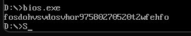

# BIOS 中断调用实验报告

## 一、实验目的

1. 熟悉 BIOS 键盘中断 **int 16h** 的使用方法，包括：
   - 非阻塞检测按键（AH=01h）
   - 阻塞读取按键（AH=00h）
   - 检测 Shift/Ctrl/Alt 等特殊按键状态（AH=02h）

2. 掌握 BIOS 显示中断 **int 10h**（AH=0Eh）在文本模式下输出字符的方式。

3. 理解 **BIOS 中断**与 **DOS 中断 int 21h** 的区别，明确本实验禁止使用 int 21h 的键盘与显示功能。

4. 完成一个 BIOS 键盘/显示程序：  
   - 不断读取并显示按键字符  
   - 当用户按下任意 Shift 键（左/右）时退出程序

---

## 二、实验要求

1. 使用 BIOS 中断 **int 16h** 获取键盘按键信息；
2. 使用 BIOS 显示中断 **int 10h** 输出字符；
3. 程序运行期间循环检测按键并输出；
4. 当用户按下 **左 Shift 或右 Shift** 时，程序立即退出；
5. 不允许使用 **int 21h 的键盘或显示功能**，但可用其退出程序（AH=4Ch）。

---

## 三、实验原理

### 1. BIOS 键盘中断 int 16h
BIOS 为键盘提供了多种功能，本实验用到三种：

| AH 功能号 | 功能 | 是否阻塞 | 返回信息 |
|----------|------|----------|----------|
| 00h | 读取按键（阻塞） | 是 | AL=ASCII, AH=扫描码 |
| 01h | 检查是否有键按下 | 否 | ZF=1 无按键 |
| 02h | 获取 Shift/Ctrl/Alt 状态 | 否 | AL = 状态位（bit0=左Shift, bit1=右Shift） |

> 注意：**Shift 键不会被 AH=00h 返回**，必须使用 AH=02h 查询状态。

---

### 2. BIOS 显示中断 int 10h（AH=0Eh）

- 在文本模式下使用 BIOS 的 TTY 输出功能即可显示字符  
- 字符放在 AL 中即可显示

---

### 3. 为什么不能用 int 21h？

**int 10h / 16h 属于 BIOS → 直接操作硬件 (键盘/显卡)**  
**int 21h 属于 DOS → 操作系统层功能（键盘输入/屏幕输出/文件）**

本实验要求练习 BIOS 层操作，因此禁止使用 int 21h 的键盘或显示功能。

---

## 四、实验代码

执行结果为：


下列代码为本实验最终可正确运行的版本，支持检测 Shift 并退出。

```asm
.MODEL SMALL
.STACK 100h

.DATA

.CODE
MAIN PROC
    MOV AX, @DATA
    MOV DS, AX

MainLoop:

    ;-----------------------------------------
    ; 1. 检查 Shift 状态（非阻塞）
    ;-----------------------------------------
    MOV AH, 02h
    INT 16h
    TEST AL, 03h       ; bit0：左Shift，bit1：右Shift
    JNZ ExitProgram    ; 任意 Shift 被按下时退出


    ;-----------------------------------------
    ; 2. 检查是否有按键（非阻塞）
    ;-----------------------------------------
    MOV AH, 01h
    INT 16h
    JZ MainLoop        ; 没有按键 → 回到循环继续检测 Shift


    ;-----------------------------------------
    ; 3. 读取按键（此时一定有按键）
    ;-----------------------------------------
    MOV AH, 00h
    INT 16h            ; AL=ASCII, AH=扫描码


    ;-----------------------------------------
    ; 4. 显示可打印字符
    ;-----------------------------------------
    CMP AL, 0
    JE MainLoop        ; 非打印键不显示

    MOV AH, 0Eh
    MOV BH, 0
    MOV BL, 07h
    INT 10h

    JMP MainLoop


ExitProgram:
    MOV AH, 4Ch
    INT 21h

MAIN ENDP
END MAIN
```
##  五、关键代码说明

### 1. 非阻塞检测键盘是否有输入

```
MOV AH, 01h
INT 16h
JZ MainLoop
```

避免程序卡死在等待按键中。

###  2. 检测 Shift 状态
```
MOV AH, 02h
INT 16h
TEST AL, 03h
JNZ ExitProgram
bit0 = 左 Shift
bit1 = 右 Shift
03h = 00000011b，用于同时检测两个 Shift
```
###  3. 显示字符
```
MOV AH, 0Eh
INT 10h
```
经典的 BIOS TTY 输出方式。

##  六、实验结果

程序运行效果如下：

用户按下普通字符（如 A B C），屏幕上会即时显示；

按 F1、方向键等扫描码键不会显示；

随时按下任意 Shift（左/右），程序立即退出；

程序未使用任何 int 21h 的键盘或显示功能，符合要求。

##  七、实验总结

通过本次实验，我掌握了以下内容：

理解了 BIOS 中断与 DOS 中断的本质区别
BIOS 层面更贴近硬件，例如 int 16h 直接访问键盘控制器。

掌握了 int 16h 三种关键功能

AH=00h 读取按键（阻塞）

AH=01h 检查是否有按键（非阻塞）

AH=02h 获取 Shift/Ctrl/Alt 状态（重要）

理解了 Shift 键无法通过 AH=00h 检测，必须通过状态字节 AL 检查。

熟悉了 int 10h 在文本模式下的字符显示方法。

通过组合不同 BIOS 功能，实现了一个流畅的键盘监测程序。

本次实验让我更加熟悉了底层硬件操作与 BIOS 中断的使用，为进一步学习操作系统原理与汇编语言打下了良好基础。
