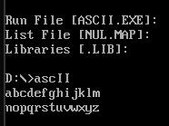
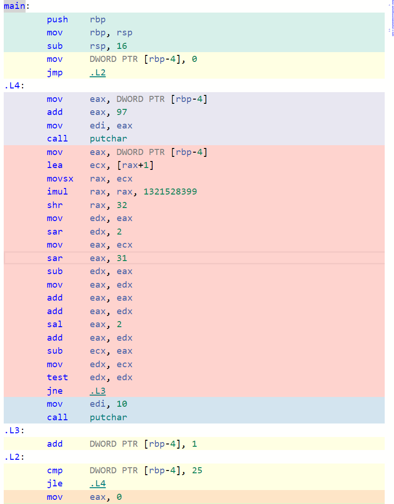

# homework 2 ASCII

## 通过 LOOP 指令实现小写英文字母的输出

程序执行结果：


汇编代码如下：

```
.MODEL SMALL                  ; 定义内存模型为 small 模式
.STACK 100h                   ; 定义堆栈大小为 256 字节

.DATA
    newline DB 0Dh, 0Ah, '$'  ; 定义换行符，0Dh 是回车符，0Ah 是换行符，$ 是 DOS 输出字符串的结束符

.CODE
MAIN PROC
    MOV AX, @DATA             ; 将数据段基地址加载到 AX
    MOV DS, AX                ; 将 AX 的值加载到数据段寄存器 DS
    MOV CX, 26                ; 初始化 CX 为 26，表示小写字母的总数
    MOV AL, 'a'               ; 初始化 AL 为 'a'，即第一个小写字母

outer_loop:
    PUSH CX                   ; 保存外层循环的 CX，准备内层循环
    MOV CX, 13                ; 初始化 CX 为 13，表示每行输出 13 个字符
    CMP AL, 'z'               ; 检查 AL 中的值是否大于 'z'
    JA end_loop               ; 如果 AL 已经超过 'z'，跳转到结束标签

inter_loop:
    MOV AH, 02h               ; 设置 AH 为 2，调用 DOS 的输出单个字符功能
    MOV DL, AL                ; 将当前的字母存入 DL 准备输出
    INT 21h                   ; 调用 DOS 中断 21h，输出字符
    INC AL                    ; 递增 AL，指向下一个字母
    LOOP inter_loop           ; 内层循环，用 LOOP 指令控制循环 13 次
    MOV AH, 09h               ; 设置 AH 为 9，调用 DOS 输出字符串功能
    LEA DX, newline           ; 将换行符的地址加载到 DX
    INT 21h                   ; 调用 DOS 中断 21h，输出换行符
    POP CX                    ; 恢复外层循环的 CX
    SUB CX, 13                ; 减去已经打印的 13 个字符
    JNZ outer_loop            ; 如果还有剩余字母（CX 不为零），跳回 outer_loop

end_loop:
    MOV AH, 4Ch               ; 设置 AH 为 4Ch，调用 DOS 的程序退出功能
    INT 21h                   ; 调用 DOS 中断 21h，程序结束

MAIN ENDP
END MAIN                      ; 程序结束
```

在编写这段汇编程序的过程中，我学到了许多关于汇编语言及其在底层操作中的精确控制。通过这次实践，我体会到了如何利用汇编中的寄存器进行数据传递，如何通过循环和条件跳转来控制程序的执行流程。

我深入理解了 `LOOP` 指令的使用。`LOOP` 通过递减 CX 寄存器的值来控制循环的执行次数，这让我意识到汇编语言的高效性——可以在简单的指令下完成复杂的循环控制。我还了解到在嵌套循环的情况下，使用 PUSH 和 POP 保存和恢复寄存器的值非常重要，这样可以确保每次循环中的变量状态不会被破坏。

我进一步巩固了对 `INT 21h` DOS 中断服务的理解，特别是如何使用 `AH=02h` 输出单个字符，和 `AH=09h` 输出以 `$` 结尾的字符串。在处理小写字母的输出时，我能感受到汇编的强大，它提供了非常细致的控制，让我能够按指定的方式逐一输出字符。

通过这次练习，我也认识到，在汇编语言中，每一个步骤都必须手动管理，虽然这增加了编程的难度，但也提供了对计算机底层操作更深的理解。这段代码让我不仅提升了对汇编语法的掌握，还让我更好地理解了 CPU 是如何逐条执行指令的，以及在循环、条件判断和中断处理等方面如何做到高效执行。

## 通过条件跳转指令实现小写英文字母的输出

程序执行结果：



汇编代码如下：

```
.MODEL SMALL                  ; 定义内存模型为 small 模式
.STACK 100h                   ; 定义堆栈大小为 256 字节

.DATA
    newline DB 0Dh, 0Ah, '$'  ; 定义换行符，0Dh 是回车符，0Ah 是换行符，$ 是 DOS 输出字符串的结束符

.CODE
MAIN PROC
    MOV AX, @DATA             ; 将数据段基地址加载到 AX
    MOV DS, AX                ; 将 AX 的值加载到数据段寄存器 DS
    MOV CX, 26                ; 初始化 CX 为 26，表示小写字母的总数
    MOV AL, 'a'               ; 初始化 AL 为 'a'，即第一个小写字母

outer_loop:
    PUSH CX                   ; 保存外层循环的 CX，准备内层循环
    MOV CX, 13                ; 初始化 CX 为 13，表示每行输出 13 个字符
    CMP AL, 'z'               ; 检查 AL 中的值是否大于 'z'
    JA end_loop               ; 如果 AL 已经超过 'z'，跳转到结束标签

inter_loop:
    CMP CX, 0                 ; 检查内层循环是否结束
    JE end_inner_loop         ; 如果 CX 为 0，则跳出内层循环
    MOV AH, 02h               ; 设置 AH 为 02h，调用 DOS 的输出单个字符功能
    MOV DL, AL                ; 将当前的字母存入 DL 准备输出
    INT 21h                   ; 调用 DOS 中断 21h，输出字符
    INC AL                    ; 递增 AL，指向下一个字母
    DEC CX                    ; 内层循环计数递减
    JMP inter_loop            ; 跳转回内层循环继续

end_inner_loop:
    MOV AH, 09h               ; 设置 AH 为 09h，调用 DOS 输出字符串功能
    LEA DX, newline           ; 将换行符的地址加载到 DX
    INT 21h                   ; 调用 DOS 中断 21h，输出换行符
    POP CX                    ; 恢复外层循环的 CX
    SUB CX, 13                ; 减去已经打印的 13 个字符
    JG outer_loop             ; 如果 CX > 0，继续外层循环

end_loop:
    MOV AH, 4Ch               ; 设置 AH 为 4Ch，调用 DOS 的程序退出功能
    INT 21h                   ; 调用 DOS 中断 21h，程序结束

MAIN ENDP
END MAIN                      ; 程序结束
```

在通过条件跳转指令实现小写英文字母输出的过程中，我对汇编语言的控制流有了更深的理解。相比使用 `LOOP` 指令的实现，这种方法依赖条件跳转指令（如 `CMP`、`JE`、`JG` 和 `JMP`）来手动控制循环的执行和跳转。这让我意识到，虽然汇编语言没有高级编程语言中的丰富控制结构，但通过灵活使用条件跳转指令，我们依然可以实现复杂的控制逻辑。

我学会了如何通过 `CMP` 和 `JE` 指令来判断循环是否结束，并跳出循环。这种手动控制计数器递减的方式不仅让我掌握了如何实现嵌套循环，还加深了我对寄存器操作的理解。在内层循环中，`CMP CX, 0` 的比较判断是否进入下一个字符的输出，这种精确的控制能够保证程序按预期输出每行13个字符。

通过这次实践，我进一步熟悉了 DOS 中断 21h 的操作。每次使用 `AH = 02h` 来输出单个字符，以及 `AH = 09h` 来输出带 `$` 结束符的字符串，帮助我巩固了对 DOS 中断机制的理解。手动输出字母并在每行结束时输出换行符，不仅展示了对中断服务的使用，还提升了我在底层程序中管理字符流的能力。

使用条件跳转指令让我更加体会到了汇编语言的灵活性和低级别编程的精细控制。在高级语言中，类似的循环可以通过简单的 `for` 或 `while` 语句实现，但在汇编中，我们需要手动管理循环计数器和跳转，这让我对底层的控制结构有了更清晰的认识。

## 通过 C 语言实现并查看反汇编代码

C 语言代码：

```c
#include <stdio.h>

int main() {
    for (int i = 0; i < 26; i++) {
        printf("%c", 'a' + i);
        if ((i + 1) % 13 == 0) {
            printf("\n");
        }
    }

    return 0;
}
```

部分反汇编代码：



部分反汇编代码解释如下：

```
076A:0000 0E                PUSH CS             ; 将代码段寄存器（CS）的值压入堆栈
076A:0001 1F                POP  DS             ; 弹出堆栈顶的数据到数据段寄存器（DS）
076A:0002 BA 0E00           MOV  DX,000E        ; 将 0x000E 移动到 DX，设置 DX 为数据段的某个偏移地址
076A:0005 B4 09             MOV  AH,09          ; 设置 DOS 中断 21h 的功能号为 09h（输出字符串）
076A:0007 CD 21             INT 21              ; 调用 DOS 中断 21h，执行字符串输出
076A:0009 B8 014C           MOV AX,4C01         ; 将 4C01 移动到 AX，调用 DOS 的程序结束功能（返回码为 1）
076A:000C CD 21             INT 21              ; 调用 DOS 中断 21h，结束程序
076A:000E 54                PUSH SP             ; 将堆栈指针（SP）的值压入堆栈
076A:000F 68 69             DB 68, 69           ; 定义两个字节的常量数据，ASCII 字符 'hi'
076A:0011 7320              JNB 0033            ; 无符号比较下跳转，如果没有进位则跳转到 0033
076A:0013 7072              JO  00787           ; 如果溢出标志设置，则跳转到 00787
076A:0015 6F                DB 6F               ; 定义字节 'o'
076A:0016 7261              JB  007A7           ; 如果有进位，则跳转到 007A7
076A:0018 6D                DB 6D               ; 定义字节 'm'
076A:0019 2063 61           AND [BP+DI+611],AH  ; 对内存地址中的值与寄存器 AH 做 AND 操作
076A:001C 6E                DB 6E               ; 定义字节 'n'
076A:001D 6E                DB 6E               ; 定义字节 'n'
076A:001F 6F                DB 6F               ; 定义字节 'o'
076A:0020 7420              JZ  0042            ; 如果零标志设置，则跳转到 0042
076A:0022 62                DB 62               ; 定义字节 'b'
076A:0023 65                DB 65               ; 定义字节 'e'
076A:0024 607275            AND [BP+SI+75],DH   ; 对内存中的值与寄存器 DH 做 AND 操作
076A:0027 20696E            AND [BX+DI+6E],CH   ; 对内存中的值与寄存器 CH 做 AND 操作
076A:002A 2444 4F           AND [SI+4F],AL      ; 对内存中的值与 AL 做 AND 操作
076A:002D 206D6F            AND [BP+6F],CH      ; 对内存地址中的值与寄存器 CH 做 AND 操作
076A:0030 53                PUSH BX             ; 将寄存器 BX 压入堆栈
076A:0031 206D6F            AND [BP+6F],CH      ; 对内存地址中的值与寄存器 CH 做 AND 操作
076A:0040 50                PUSH AX             ; 将寄存器 AX 压入堆栈
```
